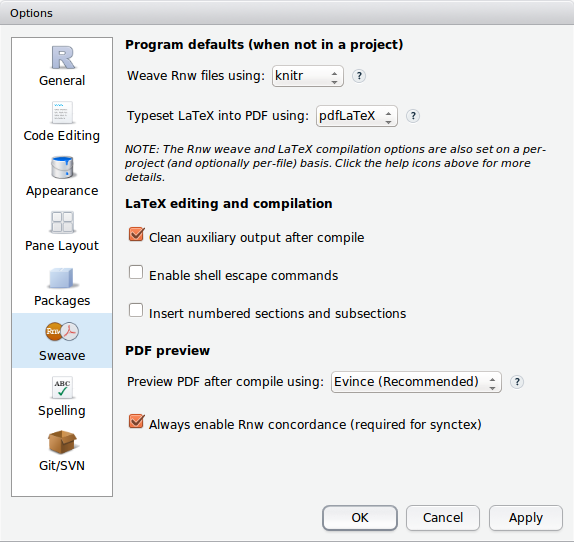
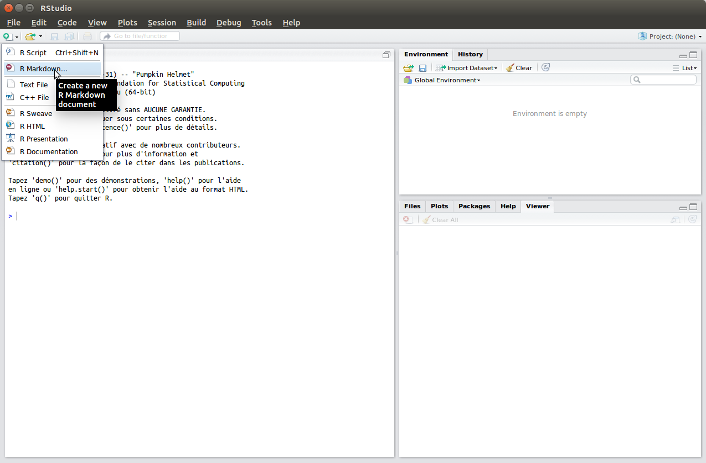
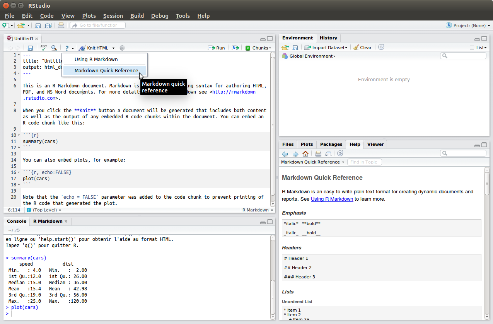
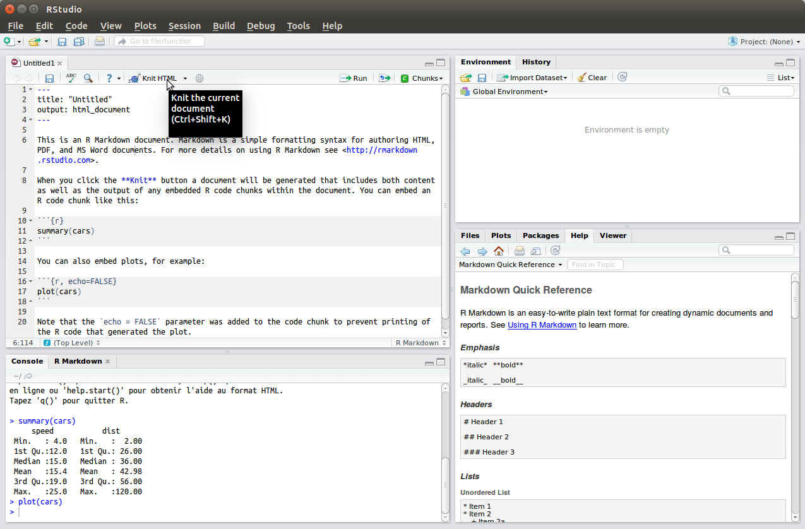

```{r, include = FALSE}
source("chunk_options.R")
opts_chunk$set(fig.path = "figure/20150108-rmarkdown-", fig.height = 5, fig.width = 10)
```

# Markdown et R Markdown pour des documents "dynamiques"

## Qu'est-ce qu'un  document "dynamique"?

Imaginons que vous avez besoin d'exporter vos résultats pour pouvoir les
intégrer dans un document que vous pourrez faire circuler  parmi vos
collaborateurs. Classiquement, vous allez copier vos tableaux à partir de votre
logiciel statistique pour ensuite les coller dans votre logiciel de traitement
de texte où vous ajouterez du contenu (vos notes, commentaires etc.). Même chose
pour vos figures, à moins que vous n'ayez pensé à les sauvegarder auparavant
dans un certain format (jpeg p.ex.). Et qu'arrivera-t-il si votre collaborateur
vous demande de corriger une petite erreur, de supprimer certaines observations
de votre base de données?

Au lieu de découpler l'écriture du texte et les résultats de votre analyse, vous
pourriez combiner l'écriture de votre contenu textuel et vos sorties
statistiques. Ce document "tout-en-un" est un document dynamique (permettant
aussi la
[recherche reproductible](http://aje.oxfordjournals.org/content/163/9/783)).

>  code + description =  rapport
>  langage informatique + langage de rédaction = rapport

Un tel document peut être créé avec R et RStudio grâce au package
[`knitr`](http://yihui.name/knitr). Le code `R` peut être combiné à différents
langages de rédaction tels que Markdown ou LaTeX.

## Qu'est-ce que Markdown?

[Markdown](http://fr.wikipedia.org/wiki/Markdown) est un langage de balisage
léger créé par [John Gruber](https://fr.wikipedia.org/wiki/John_Gruber) et
[Aaron Swartz](https://fr.wikipedia.org/wiki/Aaron_Swartz) en 2004. Avec un
logiciel de traitement de texte comme MS Word ou LibreOffice Writer, seul le
résultat final est visible mais pas les commandes de mise en forme (WYSIWYG --
What You See Is What You Get, ou What You see Is _only_ What You Get...). Avec un
langage à balises comme Markdown, LaTeX ou HTML, on écrit et voit les commandes
de mise en forme mais pas directement le résultat final.

Markdown est simple, simple, simple:

* Installation très simple;

* Langage très simple, s'apprenant rapidement;

* Export vers d'autres formats très simple (HTML, pdf, docx).

Est-ce trop simple? Tout dépend du degré de complexité que l'on veut. LaTeX est
particulièrement approprié pour _l'impression_ de documents, avec un magnifique
rendu, et la possibilité d'éditer des éléments compliqués, tels que des
formules mathématiques. Mais au prix d'une syntaxe demandant une certaine
expérience. Markdown est particulièrement dédié au HTML, avec des possibilités
de composition plus limitée que LaTeX mais permettant une interaction avec le
document.

### HTML? Mais mon superviseur veut un document .doc!

C'est ici qu'intervient [Pandoc](http://johnmacfarlane.net/pandoc). Pandoc est
un convertisseur universel de documents. Pandoc peut convertir Markdown dans de
nombreux autres formats tels que LaTeX, HTML, Rich Text Format (*.rtf*), E-Book
(*.epub*), Microsoft Word (*.docx*), OpenDocument Text (*.odt*), etc. Pandoc est
un outil en ligne de commande. Une fois un terminal ouvert, on peut écrire des
commandes telles que celles -ci pour convertir un fichier Markdown test.md dans
d'autres formats: `pandoc test.md -o test.html`, `pandoc test.md -o test.odt`,
`pandoc test.md -o test.rtf`, `pandoc test.md -o test.docx`, or `pandoc test.md
-o test.pdf`.

### Ligne de commande? Je pensais que c'était simple!

La ligne de commande, c'est simple... Mais on peut se faciliter la vie en
utilisant le package `rmarkdown` gérant les 73 arguments de ligne de commande de
Pandoc (et les 49 options de `knitr`). Le tout directement à partir de RStudio!

## Comment faire?

1. Dans RStudio, installer les packages `knitr` et `rmarkdown`:

```{r software, eval=FALSE}
install.packages('knitr', dependencies = TRUE)
install.packages("rmarkdown")
```

Puis choisir l'option "Weave Rnw files using knitr" (Tools > Global Options >
Sweave)



2. Créer un document vierge R markdown.



Un document-type est déjà disponible. Vous pouvez remplacer les parties
correspondantes par les vôtres. Si vous avez besoin d'aide pour la syntaxe
markdown, utiliser l'aide:



3. Ensuite il vous reste à "kniter" le document:



### Quand mettre en place la reproductibilité?

* N'importe quand mais c'est toujours mieux de le faire au début d'un projet.
* Toujours préférable d'êytre mis en place en même temps qu'un contrôle de
  version comme Git.
* En utilisant un logiciel comme R où les insructions sont données sous forme de
  code.
* Ne jamais sauver la sortie (seul le jeu de données brut avec le code de
  traitement. Même les jeux de données nettoyés peuvent être supprimés mais cela
  peut aider de les sauvegarder temporaireemnt lors des étapes intermédiaires).
* Finalement, enregistrer les données dans un format non-propriétaire (p.ex.
  `csv` plutôt que `xls`). Cela vous assure que vos données pourront être lues
  dans le futur. 

---
**Information additionnelle**

[`knitr`](http://yihui.name/knitr)
[Markdown cheatsheet](https://github.com/adam-p/markdown-here/wiki/Markdown-Cheatsheet)
[Original markdown reference](http://daringfireball.net/projects/markdown/basics)
[Dynamic Documents with R and knitr](http://www.crcpress.com/product/isbn/9781482203530)
[Markdown et Pandoc](http://enacit1.epfl.ch/markdown-pandoc/)
