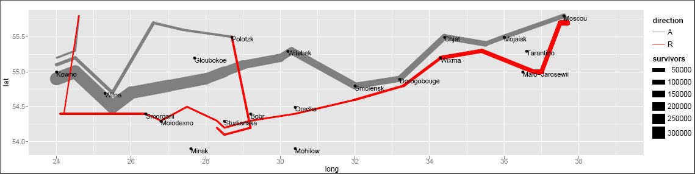

```{r, include = FALSE}
source("chunk_options.R")
opts_chunk$set(fig.path = "figure/viz-", fig.height = 5, fig.width = 10)
```

# Graphiques dans R

Un des nombreux points forts de `R` sont ses capacités graphiques. Prenez par
exemple les graphiques suivants:
[visualisation des amis Facebook](http://paulbutler.org/archives/visualizing-facebook-friends/),
[la marche de Napoléon sur Moscou](http://www.datavis.ca/gallery/re-minard.php),
ou cette [carte des vents](http://hint.fm/wind/index.html).


\



La plupart des output de modèles ont une méthode `plot` qui leur est associée,
qui permet de visualiser rapidement les résultats d'une analyse avec une
interface cohérente.

Dans cette leçon, nous allons apprendre les graphiques de base (`base
graphics`), qui est le système de graphique le plus ancien dans `R`. Des
*packages* graphiques plus avancés comme 
[`lattice`](https://www.springer.com/new+%26+forthcoming+titles+%28default%29/book/978-0-387-75968-5)
et `ggplot2` sont aussi utilisé communément. `ggplot2` sera couvert dans un
deuxième temps.

## `Base`

`Base graphics` utilise la fonction `plot()` pour créer un graphe. Le type de
graphe dépend de la `class` des arguments donnés. `plot(x, y)` va donner un
diagramme de dispersion mais si `x` est un facteur, cela donnera une boîte à
moustache. On peut aussi utiliser des fonctions plus évoluées comme `hist()`
pour créer un histogramme ou `qqnorm()` pour obtenir un diagramme
quantile-quantile (QQ-plot). On peut fournir des arguments additionnels comme
`type =` pour définir un type de graphe (`p` pour points, `l` pour ligne, ...),
`main =` et `sub =` pour des titres et sous-titres, `xlab =` et `ylab =` pour
les labels des axes.

```{r plot1}
library(gapminder)
plot(lifeExp ~ gdpPercap, data = gapminder[gapminder$year == 2002, ], log = "x")
```

```{r plot2}
mycol <- c(Africa = "cadetblue1", Americas = "chartreuse", Asia = "darkred",
           Europe = "darkorchid1", Oceania = "blue")
plot(lifeExp ~ gdpPercap, data = gapminder[gapminder$year == 2002, ], log = "x",
     col = mycol[continent])
```

> **Note:** Pour une référence des couleurs de `R`:
> [`R` Color Chart](http://research.stowers-institute.org/efg/R/Color/Chart/)

```{r trend}
trend <- lm(lifeExp ~ log10(gdpPercap), data = gapminder[gapminder$year == 2002, ])
```

```{r plot-trend}
plot(lifeExp ~ gdpPercap, data = gapminder[gapminder$year == 2002, ], log = "x",
     col = mycol[continent])
abline(trend)
```

## `ggplot2`

[`ggplot2`](http://docs.ggplot2.org/current/index.html) vous donne la
flexibilité de créer une large varitété de graphiques sophistiqués avec très peu
de lignes de code. Les graphiques créés avec `ggplot2` sont plus élégants que
les graphiques `base`.

```{r, warning=FALSE, message=FALSE}
library(ggplot2)
qplot(lifeExp, log10(gdpPercap), data = gapminder[gapminder$year == 2002, ],
      geom = "point")
```

La fonction `qplot` travaille pas mal de la même manière que  `plot` dans `R` de
base. Mais `ggplot2` peut faire bien plus.

__gg__ est pour __grammar of graphics__, introduit par
[Leland Wilkinson](https://www.springer.com/statistics/computational+statistics/book/978-0-387-24544-7).
Qu'est-ce que la grammaire des graphiques? Déconstruisons le graphe ci-dessous.

```{r, warning=FALSE}
ggplot(gapminder[gapminder$year == 2002, ],
       aes(x = log10(gdpPercap), y = lifeExp)) +
    geom_point(aes(color = continent)) +
    geom_smooth(method = 'lm')
```

 il y a deux séries d'éléments dans ce graphe:

__Aesthetics__

D'abord consacrons nous sur les variables `gdpPercap`, `lifeExp` et `continent`.
Vous remarquez à partir du graphe que nous avons attribué `gdpPercap` à `x`,
`lifeExp` à `y` et la couleur des points à `continent`. Les propriétés
graphiques de `x`, `y` et `continent` qui codent les données sur le graphe sont
appelées `aesthetics`. D'autres `aesthetics` sont `size`, `shape` etc.

__Geometries__

Le second élément à porter attention sont les éléments visuels que vous voyer
dans le graphe lui-mêmes. Il y a 3 éléments visuels distincts dans ce graphique:

- point
- ligne
- ruban (`ribbon`)

Ces éléments graphiques affichés dans le graphique sont nommés `geometries`.
D'autres `geometries` sont `area`, `bar`, `text`.

Un autre manière de penser à ce graphique est en terme de couches (`layers`).
Vous pouvez imaginer une couche comme étant composée de données (`data`), une
cartographie (`mapping`) d'esthétiques (`aesthetics`), une géométrie
(`geometry`) pour affichage visuel, et parfois des paramètres additionnels pour
personnaliser l'affichage.

Il y a 3 couches dans ce graphe. Une couche de `point`, une couche de `line` et
une couche de `ribbon`. `ggplot2` vous permet de convertir la couche (`layer`)
exactement comme vous la percevez en termes d'éléments constitutifs.

## Faceting

```{r facet-wrap, warning = FALSE}
ggplot(gapminder, aes(x = log10(gdpPercap), y = lifeExp)) +
    geom_point() +
    geom_smooth(method = 'lm') +
        facet_wrap(~ continent)
```

## Petit à petit construire son diagramme de dispersion

```{r}
p <- ggplot(gapminder[gapminder$year < 1973, ],
            aes(x = gdpPercap, y = lifeExp))
p + geom_point()
p + geom_point() + scale_x_log10()
p <- p + scale_x_log10()

p + geom_point(aes(color = continent))
ggplot(gapminder[gapminder$year < 1973, ],
       aes(x = gdpPercap, y = lifeExp, color = continent)) +
    geom_point() + scale_x_log10()

# transparence et taille
p + geom_point(alpha = .35, size = 3)

p + geom_point() + geom_smooth()
p + geom_point() + geom_smooth(lwd = 1, se = FALSE)
p + geom_point() + geom_smooth(lwd = 1, se = FALSE, method = "lm")

p + aes(color = continent) +
    geom_point() +
        geom_smooth(lwd = 1, se = FALSE, method = "lm")

p + geom_point(alpha = .35, size = 3) +
    facet_wrap(~ continent)
p + geom_point(alpha = .35, size = 3) +
    facet_wrap(~ continent) +
        geom_smooth(lwd = 1, se = FALSE, method = "lm")
```

## Petit à petit décrire ses données

Histogramme:

```{r histo}
ggplot(gapminder[gapminder$year > 1990, ], aes(x = lifeExp)) +
    geom_histogram()

ggplot(gapminder[gapminder$year > 1990, ], aes(x = lifeExp)) +
    geom_density()

ggplot(gapminder[gapminder$year > 1990, ], aes(x = lifeExp, color = continent)) +
    geom_density()

ggplot(gapminder[gapminder$year > 1990, ], aes(x = lifeExp, fill = continent)) +
    geom_density(alpha = 0.2)

ggplot(gapminder[gapminder$year > 1990, ], aes(x = lifeExp)) +
    geom_density() +
        facet_wrap(~ continent)
```

Boîte à moustache:

```{r boxplot}
ggplot(gapminder[gapminder$year > 1990, ], aes(x = year, y = lifeExp)) +
    geom_boxplot(aes(group = year))

ggplot(gapminder[gapminder$year > 1990, ], aes(x = year, y = lifeExp)) +
    geom_boxplot(aes(group = year), outlier.colour = "cyan") +
        geom_jitter(position = position_jitter(width = 0.1, height = 0), alpha = 1/4)

```

## Graphiques à barres

```{r barplot}
ggplot(gapminder[gapminder$year > 1990, ], aes(x = continent)) +
    geom_bar()
```

## Sauvegarder ses graphes

`R` peut générer des graphiques dans n'importe quel format (pdf, postscript,
bitmap, svg, png, jpeg, tiff). Juste signaler à `R` de sauvegarder le graphe qui
est couramment affiché:

```{r}
plot(1:10)
dev.copy(png, file = "myPlot.png")
dev.off()
```

Si vous voulez sauvegarder le graphe sans le voir:

```{r}
pdf(file = "myPlot.pdf")
plot(1:10)
dev.off()
```

Si le graphe a été produit par `ggplot2`:

```{r, eval=FALSE}
ggsave("myPlot.pdf")

# si objet
ggsave(p, file = "myPlot.pdf")

# taille
ggsave(file = "myPlot.png", width = 5, height = 3.5)
```

---
**Informations additionnelles**

- [`ggplot2`](http://ggplot2.org/)
- [Documentation en ligne de `ggplot2`](http://docs.ggplot2.org/current/)
- [The R Graphics Cookbook](http://shop.oreilly.com/product/0636920023135.do)
- [Cookbook for R](http://www.cookbook-r.com/Graphs/)
- [`ggplot2` le livre](http://www.amazon.ca/ggplot2-Elegant-Graphics-Data-Analysis-ebook/dp/B0041KLFRW/ref=sr_1_1?ie=UTF8&qid=1431313563&sr=8-1&keywords=ggplot2%3A+Elegant+Graphics+for+Data+Analysis) et son [site web](http://ggplot2.org/book/)

